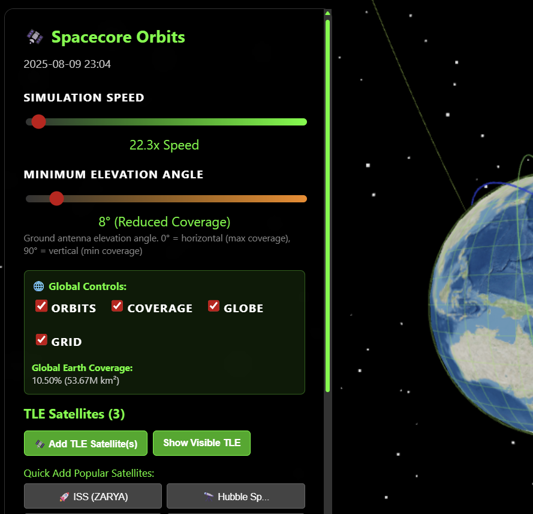
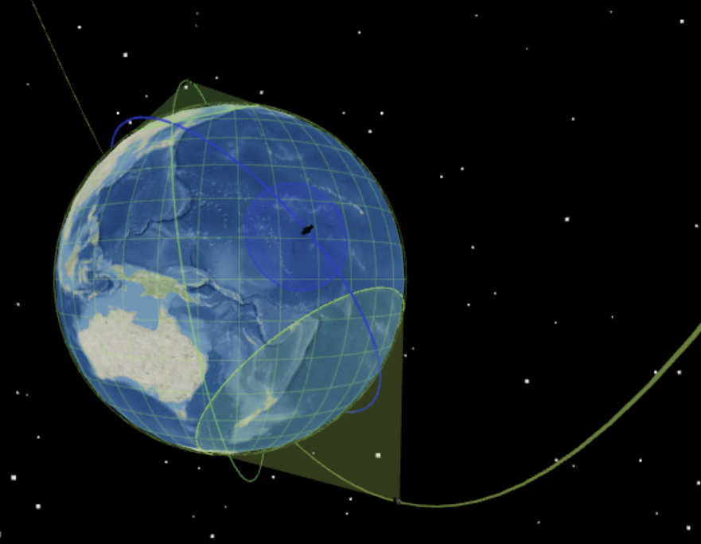

# Spacecore Orbits

A React-based 3D Earth and satellite simulation using WebGL and Three.js. This application provides a realistic simulation of Earth's rotation and satellite orbital mechanics with adjustable parameters and time controls.

&nbsp;


## Features

- **3D Earth Visualization**: Realistic Earth with procedural textures, atmosphere, and cloud layers
- **Satellite Orbital Mechanics**: Accurate orbital calculations with configurable parameters
- **TLE Support**: Add real satellites using Two-Line Element (TLE) format data
- **Multiple Satellites**: Support for multiple satellites with different colors and visibility controls
- **Speed Control**: Simulation speed from real-time to 1000x acceleration
- **Interactive Controls**: 
  - Manual satellite: altitude (200km to 35,786km), orbital inclination (0° to 180°)
  - TLE satellites: Add any satellite using standard TLE format
  - Preset orbits (ISS, Geostationary, Sun-Synchronous)
  - Individual satellite orbit and trail visibility controls
- **3D Camera Controls**: Mouse-based rotation, zoom, and pan
- **Orbital Information**: Real-time display of velocity, period, and orbital parameters
- **Performance Optimized**: WebGL optimization for smooth rendering

## Prerequisites

Choose one of the following options to run the application:

### Option 1: Docker (Recommended)
- Docker Desktop or Docker Engine
- Docker Compose
- A modern web browser with WebGL support

### Option 2: Local Development
- Node.js (version 14 or higher)
- npm or yarn package manager
- A modern web browser with WebGL support

## Installation & Running

### 🐳 Running with Docker (Recommended)

The easiest way to run SpaceCore Simulation is using Docker:

#### Production Build
1. **Clone and navigate to the project directory**:

   ```bash
   git clone <repository-url>
   cd spacecore-simulation
   ```

2. **Build and start the application**:
   ```bash
   docker-compose up -d
   ```

3. **Open your browser** and navigate to:
   ```
   http://localhost:3000
   ```

4. **Stop the application**:
   ```bash
   docker-compose down
   ```

#### Development Mode with Hot Reloading
For development with live code reloading:

1. **Start development environment**:
   ```bash
   docker-compose --profile dev up -d spacecore-dev
   ```

2. **Access development server**:
   ```
   http://localhost:3001
   ```

#### Easy Startup Scripts
For convenience, use the provided startup scripts:

**Windows:**
```bash
# Double-click or run in PowerShell
start-docker.bat
```

**Linux/Mac:**
```bash
# Make executable and run
chmod +x start-docker.sh
./start-docker.sh
```

**npm scripts:**
```bash
# Quick commands
npm run docker:up        # Start production
npm run docker:dev       # Start development
npm run docker:down      # Stop services
npm run docker:logs      # View logs
```

#### Docker Commands Quick Reference
```bash
# Build and start (production)
docker-compose up -d

# Start development mode
docker-compose --profile dev up -d spacecore-dev

# View logs
docker-compose logs -f

# Stop all services
docker-compose down

# Rebuild containers
docker-compose up -d --build

# Remove containers and volumes
docker-compose down -v
```

### 💻 Local Development Setup

If you prefer to run without Docker:

1. **Install Node.js** (if not already installed):
   - Download from [nodejs.org](https://nodejs.org/)
   - Follow the installation instructions for your operating system

2. **Navigate to the project directory**:
   ```bash
   cd spacecore-simulation
   ```

3. **Install dependencies**:
   ```bash
   npm install
   ```

4. **Start the development server**:
   ```bash
   npm start
   ```

5. **Open your browser** and navigate to:
   ```
   http://localhost:3000
   ```

The application should automatically open in your default browser.

## Usage

### Control Panel

The control panel on the left side provides:

- **Simulation Speed**: Slider to control time acceleration (0.1x to 1000x)
- **Altitude**: Adjust satellite height above Earth (200-35,786 km)
- **Inclination**: Orbital plane angle (0-180 degrees)
- **Preset Orbits**: Quick-select buttons for common orbits

### Camera Controls

- **Mouse Left-Click + Drag**: Rotate the view around Earth
- **Mouse Wheel**: Zoom in and out
- **Mouse Right-Click + Drag**: Pan the view
- **Reset**: Double-click to reset camera position

### Orbital Information

Real-time display shows:
- Orbital velocity (km/s)
- Orbital period (minutes)
- Current altitude and inclination

## TLE Satellite Support

The simulation supports adding real satellites using Two-Line Element (TLE) format data. TLE is the standard format used by NORAD and other space agencies to distribute satellite orbital information.

### Adding TLE Satellites
1. Click **"Add TLE Satellite"** button in the control panel
2. Enter the satellite name and the two TLE lines
3. Click **"Add Satellite"** to add it to the simulation

### Sample TLE Data
The application includes sample TLE data for:
- **ISS (ZARYA)**: International Space Station
- **HST**: Hubble Space Telescope  
- **STARLINK-1007**: SpaceX Starlink satellite

### TLE Data Sources
You can get current TLE data from these sources:
- [CelesTrak](https://celestrak.org/) - Comprehensive satellite database
- [Space-Track](https://www.space-track.org/) - Official US government source
- [N2YO](https://www.n2yo.com/) - Real-time satellite tracking

### TLE Format Example
```
ISS (ZARYA)
1 25544U 98067A   24001.00000000  .00020137  00000-0  16538-3 0  9993
2 25544  51.6461 339.2377 0001078  88.2548 271.9142 15.48919103123456
```

### Managing TLE Satellites
- **Remove**: Click the ✕ button next to any satellite
- **Toggle Orbit**: Show/hide the orbital path
- **Toggle Trail**: Show/hide the satellite's movement trail
- **Multiple Satellites**: Add as many satellites as needed (each gets a unique color)
- **Manual Satellite**: Toggle visibility of the manually configured satellite

## Preset Orbits

### International Space Station (ISS)
- Altitude: 408 km
- Inclination: 51.6°
- Period: ~93 minutes

### Geostationary Orbit
- Altitude: 35,786 km
- Inclination: 0°
- Period: 24 hours

### Sun-Synchronous Orbit
- Altitude: 780 km
- Inclination: 98.2°
- Period: ~100 minutes

## Technical Details

### Dependencies

- **React**: Frontend framework
- **Three.js**: 3D graphics library
- **@react-three/fiber**: React renderer for Three.js
- **@react-three/drei**: Useful helpers for React Three Fiber

### Performance Features

- WebGL optimization settings
- Reduced shadow map resolution for performance
- Efficient geometry updates
- Error boundaries for graceful failure handling

### Orbital Mechanics

The simulation uses simplified Keplerian orbital mechanics:
- Circular orbits (eccentricity = 0)
- Two-body problem (Earth-satellite system)
- Gravitational parameter: μ = 398,600.4418 km³/s²
- Earth radius: 6,371 km

## Browser Compatibility

Tested and supported on:
- Chrome 90+
- Firefox 88+
- Safari 14+
- Edge 90+

**Note**: WebGL support is required. Older browsers may not be compatible.

## Troubleshooting

### Docker Issues

#### Container Won't Start
1. Ensure Docker is running: `docker --version`
2. Check if ports are available: `netstat -an | grep :3000`
3. View container logs: `docker-compose logs -f`
4. Rebuild containers: `docker-compose up -d --build`

#### Build Failures
1. Clear Docker cache: `docker system prune -a`
2. Ensure sufficient disk space (at least 2GB free)
3. Check Docker memory allocation (increase if needed)
4. Verify Dockerfile syntax

#### Performance Issues in Docker
1. Increase Docker memory allocation (4GB+ recommended)
2. Enable Docker Desktop's "Use the WSL 2 based engine" (Windows)
3. Close unnecessary containers: `docker stop $(docker ps -q)`

### Local Development Issues

#### Application Won't Start
1. Ensure Node.js is properly installed: `node --version`
2. Delete `node_modules` and run `npm install` again
3. Check that port 3000 is available
4. Clear npm cache: `npm cache clean --force`

#### Performance Issues
1. Close other browser tabs/applications
2. Update your graphics drivers
3. Try disabling browser extensions
4. Reduce simulation speed or satellite trail length

### WebGL Errors
1. Update your browser to the latest version
2. Enable hardware acceleration in browser settings
3. Try a different browser
4. Check if your GPU supports WebGL: Visit [webglreport.com](https://webglreport.com/)

### Common Solutions
- **Port already in use**: Change port in docker-compose.yml or stop conflicting services
- **Memory issues**: Increase Docker memory limit or close other applications
- **Build timeouts**: Check internet connection and Docker registry availability

## Development

To build for production:
```bash
npm run build
```

To run tests:
```bash
npm test
```

## License

This project is open source and available under the MIT License.

## Contributing

Contributions are welcome! Please feel free to submit issues or pull requests.