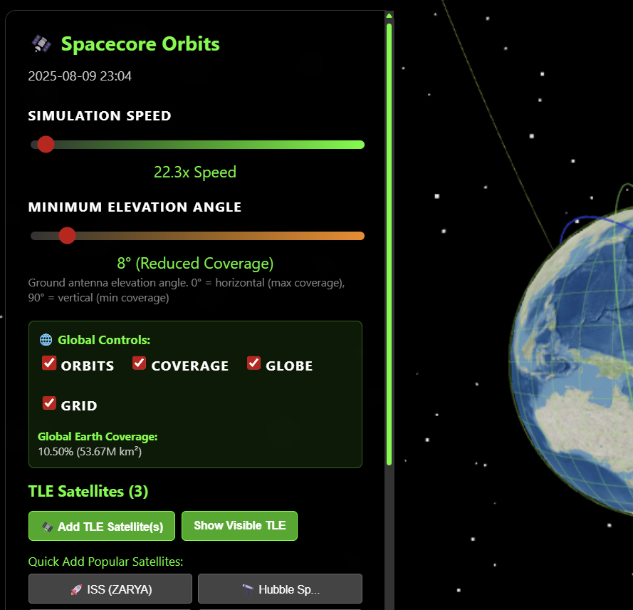
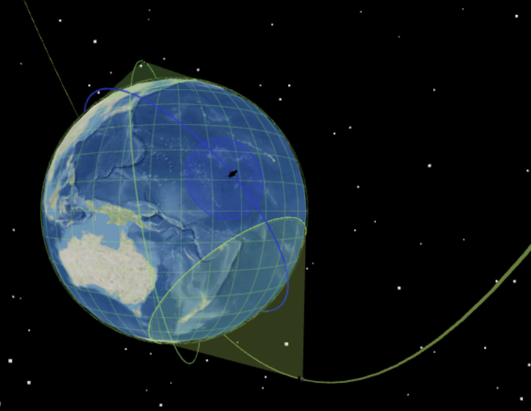

# Spacecore Orbits

A React-based 3D Earth and satellite simulation using WebGL and Three.js. This application provides a realistic simulation of Earth's rotation and satellite orbital mechanics with adjustable parameters and time controls.

&nbsp;


## Features

- **3D Earth Visualization**: Realistic Earth with procedural textures, atmosphere, and cloud layers
- **TLE Satellite Support**: Add real satellites from NORAD-style Two-Line Element data, with bulk paste, saved favorites, and coverage analysis
- **Multiple Satellites**: Support for many satellites with unique colors and per-satellite visibility controls
- **Coverage Analysis**: Earth coverage caps per satellite, global union coverage, and minimum elevation angle
- **Constellation Planning**: Generate a minimal phased constellation from a single TLE to approximate full Earth coverage
- **Speed Control**: Simulation speed from real-time to 1000x acceleration, with pause/resume
- **Scene Export**:
  - **3D Model (GLB)**: Download the visible scene as a textured GLB mesh
  - **2D SVG**: Download a high-resolution snapshot of the current camera view
- **3D Camera Controls**: Mouse-based rotation, zoom, and pan
- **Theme Support**: Light, dark, and other color schemes
- **Performance Optimized**: WebGL optimization for smooth rendering

## Prerequisites

Choose one of the following options to run the application:

### Option 1: Docker (Recommended)
- Docker Desktop or Docker Engine
- Docker Compose
- A modern web browser with WebGL support

### Option 2: Local Development
- Node.js (version 14 or higher)
- npm or yarn package manager
- A modern web browser with WebGL support

## Installation & Running

### 🐳 Running with Docker (Recommended)

The easiest way to run SpaceCore Simulation is using Docker:

#### Production Build
1. **Clone and navigate to the project directory**:

   ```bash
   git clone <repository-url>
   cd spacecore-simulation
   ```

2. **Build and start the application**:
   ```bash
   docker-compose up -d
   ```

3. **Open your browser** and navigate to:
   ```
   http://localhost:3000
   ```

4. **Stop the application**:
   ```bash
   docker-compose down
   ```

#### Development Mode with Hot Reloading
For development with live code reloading:

1. **Start development environment**:
   ```bash
   docker-compose --profile dev up -d spacecore-dev
   ```

2. **Access development server**:
   ```
   http://localhost:3001
   ```

#### Easy Startup Scripts
For convenience, use the provided startup scripts:

**Windows:**
```bash
# Double-click or run in PowerShell
start-docker.bat
```

**Linux/Mac:**
```bash
# Make executable and run
chmod +x start-docker.sh
./start-docker.sh
```

**npm scripts:**
```bash
# Quick commands
npm run docker:up        # Start production
npm run docker:dev       # Start development
npm run docker:down      # Stop services
npm run docker:logs      # View logs
```

#### Docker Commands Quick Reference
```bash
# Build and start (production)
docker-compose up -d

# Start development mode
docker-compose --profile dev up -d spacecore-dev

# View logs
docker-compose logs -f

# Stop all services
docker-compose down

# Rebuild containers
docker-compose up -d --build

# Remove containers and volumes
docker-compose down -v
```

### 💻 Local Development Setup

If you prefer to run without Docker:

1. **Install Node.js** (if not already installed):
   - Download from [nodejs.org](https://nodejs.org/)
   - Follow the installation instructions for your operating system

2. **Navigate to the project directory**:
   ```bash
   cd spacecore-simulation
   ```

3. **Install dependencies**:
   ```bash
   npm install
   ```

4. **Start the development server**:
   ```bash
   npm start
   ```

5. **Open your browser** and navigate to:
   ```
   http://localhost:3000
   ```

The application should automatically open in your default browser.

## Usage

### Control Panel

The control panel provides simulation controls, export buttons, and TLE management:

- **Simulation Speed**: Slider from 0.1x to 1000x, with pause/resume
- **Export**: **⬇ 3D Model** and **⬇ 2D SVG** buttons (see [Scene Export](#scene-export) below)
- **Minimum Elevation Angle**: Ground antenna elevation threshold for coverage calculations (0° = maximum coverage)
- **Global Controls**: Toggle orbits, coverage caps, beams, globe, and grid for all satellites
- **TLE Satellites**: Add, save, export, and manage real satellite orbits

### Camera Controls

- **Mouse Left-Click + Drag**: Rotate the view around Earth
- **Mouse Wheel**: Zoom in and out
- **Mouse Right-Click + Drag**: Pan the view
- **Reset**: Double-click to reset camera position

## Scene Export

Export the current simulation state from the control panel under the speed slider.

### 3D Model (GLB)

Click **⬇ 3D Model** to download a GLB file of the visible scene.

- **Format**: GLB (binary glTF) with embedded textures
- **Contents**: Earth globe, visible satellite meshes, orbit tubes, and coverage cones currently shown in the scene
- **Excluded**: Line geometry (e.g. coverage rings), stars, lights, cameras, and hidden objects
- **Filename**: `spacecore-orbit-YYYY-MM-DD-HHMMSS.glb` (timestamp reflects simulation time)
- **Tip**: Position the camera and toggle visibility (globe, coverage, satellites) before exporting. At least one visible mesh is required.

The GLB can be opened in Blender, three.js viewers, or other 3D tools for presentations, documentation, or further editing.

### 2D SVG

Click **⬇ 2D SVG** to download a vector snapshot of the current view.

- **Format**: SVG with an embedded high-resolution PNG of the WebGL render (2× canvas resolution)
- **Contents**: Exactly what you see on screen — Earth, satellites, coverage overlays, and theme background
- **Filename**: `spacecore-orbit-YYYY-MM-DD-HHMMSS.svg`
- **Tip**: Pause the simulation and frame the view you want before exporting. SVG is ideal for reports, slides, and print.

## TLE Satellite Support

The simulation supports real satellites using **Two-Line Element (TLE)** data — the standard NORAD format for distributing orbital elements. Positions are propagated with an SGP4-based model.

For a visual walkthrough of the TLE UI, see [TLE_GUIDE.md](TLE_GUIDE.md).

### Adding TLE Satellites

**Quick add (popular satellites):** Click any preset button (ISS, Hubble, Starlink, NOAA-19, GPS, GOES-16, Terra, Molniya, OFEQ-16) to add it immediately.

**Bulk paste:**
1. Click **🛰️ Add TLE Satellite(s)**
2. Paste one or more TLE blocks. Each block is an optional name line followed by line 1 (starts with `1 `) and line 2 (starts with `2 `)
3. Click **Add Satellite(s)** — all valid pairs are added at once

**Example (single satellite):**
```
ISS (ZARYA)
1 25544U 98067A   24001.00000000  .00020137  00000-0  16538-3 0  9993
2 25544  51.6461 339.2377 0001078  88.2548 271.9142 15.48919103123456
```

**Example (multiple satellites):**
```
ISS (ZARYA)
1 25544U 98067A   24001.00000000  .00020137  00000-0  16538-3 0  9993
2 25544  51.6461 339.2377 0001078  88.2548 271.9142 15.48919103123456

MOLNIYA 1-91
1 25485U 98054A   25220.25238000  -.00000045  00000+0  00000+0 0  9999
2 25485  64.5387 331.0544 6772907 286.8560 13.3661  2.36441399 206179
```

### Saved TLEs

- Click **☆** on any satellite card to save it to browser localStorage
- Saved TLEs appear as quick-add buttons under **Saved:** in the control panel
- Remove a saved entry with the ✕ on its button
- Saved TLEs persist across sessions; active satellites in the scene do not

### Show Visible TLE

Click **Show Visible TLE** to display the raw TLE text for all satellites with coverage visible. Copy the output to share, archive, or import elsewhere.

### Constellation Generator

With at least one TLE satellite loaded, **Show minimal constellation (~100% coverage)** generates additional phased satellites across multiple orbital planes derived from the first satellite's TLE. Use this to explore what a minimal constellation might look like for near-global coverage at the current minimum elevation angle.

### TLE Data Sources

Current TLE data is available from:
- [CelesTrak](https://celestrak.org/) — Comprehensive satellite database
- [Space-Track](https://www.space-track.org/) — Official US government source
- [N2YO](https://www.n2yo.com/) — Real-time satellite tracking

### Managing TLE Satellites

Each satellite card shows altitude range, inclination, period, live position, and Earth coverage percentage.

- **Remove**: ✕ on the satellite card, or **Remove All**
- **Save**: ☆ to add to saved favorites
- **Global toggles**: Orbits, Coverage, Beams, Globe, Grid (under Global Controls)
- **Global Earth Coverage**: Union of all visible coverage caps, shown as percentage and area

## Technical Details

### Dependencies

- **React**: Frontend framework
- **Three.js**: 3D graphics library
- **@react-three/fiber**: React renderer for Three.js
- **@react-three/drei**: Useful helpers for React Three Fiber

### Performance Features

- WebGL optimization settings
- Reduced shadow map resolution for performance
- Efficient geometry updates
- Error boundaries for graceful failure handling

### Orbital Mechanics

TLE satellites use SGP4-based propagation from parsed NORAD elements (inclination, RAAN, eccentricity, mean anomaly, mean motion, etc.).

Coverage caps are computed from satellite altitude and the configured minimum elevation angle.

Constants:
- Gravitational parameter: μ = 398,600.4418 km³/s²
- Earth radius: 6,378.137 km

## Browser Compatibility

Tested and supported on:
- Chrome 90+
- Firefox 88+
- Safari 14+
- Edge 90+

**Note**: WebGL support is required. Older browsers may not be compatible.

## Troubleshooting

### Docker Issues

#### Container Won't Start
1. Ensure Docker is running: `docker --version`
2. Check if ports are available: `netstat -an | grep :3000`
3. View container logs: `docker-compose logs -f`
4. Rebuild containers: `docker-compose up -d --build`

#### Build Failures
1. Clear Docker cache: `docker system prune -a`
2. Ensure sufficient disk space (at least 2GB free)
3. Check Docker memory allocation (increase if needed)
4. Verify Dockerfile syntax

#### Performance Issues in Docker
1. Increase Docker memory allocation (4GB+ recommended)
2. Enable Docker Desktop's "Use the WSL 2 based engine" (Windows)
3. Close unnecessary containers: `docker stop $(docker ps -q)`

### Local Development Issues

#### Application Won't Start
1. Ensure Node.js is properly installed: `node --version`
2. Delete `node_modules` and run `npm install` again
3. Check that port 3000 is available
4. Clear npm cache: `npm cache clean --force`

#### Performance Issues
1. Close other browser tabs/applications
2. Update your graphics drivers
3. Try disabling browser extensions
4. Reduce simulation speed or satellite trail length

### WebGL Errors
1. Update your browser to the latest version
2. Enable hardware acceleration in browser settings
3. Try a different browser
4. Check if your GPU supports WebGL: Visit [webglreport.com](https://webglreport.com/)

### Common Solutions
- **Port already in use**: Change port in docker-compose.yml or stop conflicting services
- **Memory issues**: Increase Docker memory limit or close other applications
- **Build timeouts**: Check internet connection and Docker registry availability

## Development

To build for production:
```bash
npm run build
```

To run tests:
```bash
npm test
```

## License

This project is open source and available under the MIT License.

## Contributing

Contributions are welcome! Please feel free to submit issues or pull requests.